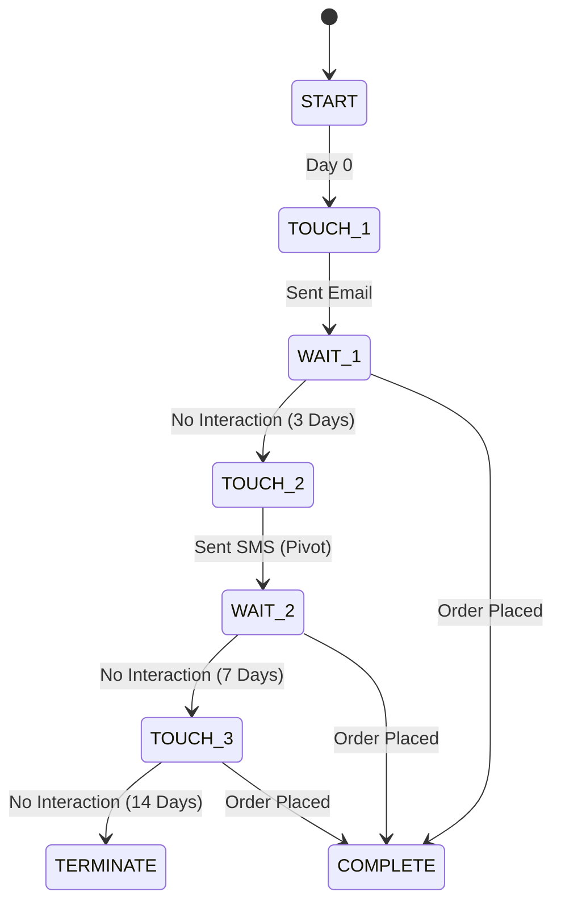

# Reactivation Agent: Deterministic Journey State Machine

**Version**: 1.0 **Status**: Needs Strict Enforcement **Implementation**:
`app.agents.reactivation.ReactivationAgent`

---

## 1. The "No-Loop" Philosophy

Reactivation journeys are **Finite State Machines (FSM)**. They must have a
clear Start and a clear End. They cannot loop indefinitely. The LLM controls the
_Content_ (Tone/Subject), but the _State Machine_ controls the _Flow_.

---

## 2. The 3-Touch State Machine

All reactivation journeys follow this strict linear path.

### State Definitions

| State       | Channel          | Logic                                                                                    | Delay to Next |
| :---------- | :--------------- | :--------------------------------------------------------------------------------------- | :------------ |
| **TOUCH_1** | **Email Only**   | Gentle "We Miss You". No Discount or Low Discount (10%).                                 | 3 Days        |
| **TOUCH_2** | **SMS Pivot**    | Channel Pivot. Higher Urgency. Moderate Discount (15-20%). Only sent if Touch 1 ignored. | 7 Days        |
| **TOUCH_3** | **Omni-Channel** | "Break Glass". Max Discount (25+%). Final Notice.                                        | 14 Days (End) |

---

## 3. Transition Rules

1. **Conversion Interrupt (The "Golden Rule")**:
   - Listing for `order_created` webhooks globally.
   - If `Customer` places an order, **IMMEDIATELY** transition state to
     `COMPLETE_SUCCESS`.
   - _Reason_: Never ask a customer to come back if they just came back.

2. **Anti-Spam Cooldown**:
   - Once a journey ends (Success or Failure), the customer enters a **90-Day
     Global Blocklist** for Reactivation.
   - _Reason_: Prevent harassment of churned customers.

3. **Channel Opt-Out**:
   - If `SMS` is planned for Touch 2 but customer is `sms_opt_in=False`,
     **SKIP** to Touch 3 (Email) immediately or terminate if no channels remain.
