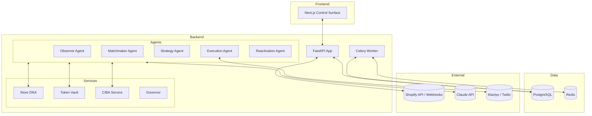

# Cephly Multi-Agents: System Blueprint

This document serves as the master manual and technical blueprint for the Cephly
Multi-Agents system. It is designed to provide comprehensive context for
developers and AI agents to understand, replicate, and extend the system.

## 1. Architecture Overview

### 1.1 The "Inbox-First" Philosophy

Cephly is built on the principle of **Autonomous Control with Human Oversight
(HITL)**. Agents operate autonomously to detect issues (Dead Stock), segment
customers (Matchmaker), and propose strategies (Strategy Agent). All high-stakes
actions are funneled through the **Inbox-First Control Surface**, requiring
explicit merchant approval before execution.

### 1.2 Tech Stack

- **Backend**: FastAPI (Python 3.11/3.13)
- **Database**: PostgreSQL (SQLAlchemy Async)
- **Caching/Queuing**: Redis
- **Background Tasks**: Celery
- **Frontend**: Next.js 14 (React, TypeScript)
- **AI/LLM**: Anthropic Claude (via `claude_api.py` and `llm_router.py`)
- **Infrastructure**: Docker & Docker Compose

### 1.3 System Components Map

## 2. Core Components Deep Dive

### 2.1 AI Agents

Agents are located in [backend/app/agents/]

| Agent          | Purpose                                | Trigger             | Core Logic                                                     |
| :------------- | :------------------------------------- | :------------------ | :------------------------------------------------------------- |
| **Observer**   | Detects dead stock and inventory drag. | Daily / Manual Scan | Analyzes sales velocity, stock levels, and "drag" metrics.     |
| **Matchmaker** | Segments customers for reactivation.   | Post-Observer       | RFM (Recency, Frequency, Monetary) analysis.                   |
| **Strategy**   | Proposes clearance/reactivation plans. | Inbox Approval      | LLM-driven strategy selection based on DNA and Inventory Drag. |
| **Execution**  | Deploys campaigns to Shopify/Klaviyo.  | Final Approval      | Orchestrates discounts, product updates, and messaging.        |

### 2.2 Critical Services

Services are located in
[backend/app/services/](file:///c:/Users/Sagtiyini%20Gray/Desktop/cephly_multiagnets/backend/app/services).

- **Store DNA (`dna.py`)**: Captures merchant's brand voice, industry, and value
  propositions to ensure agent alignment.
- **Token Vault (`token_vault.py`)**: Securely handles merchant credentials and
  encrypted tokens.
- **CIBA Service (`ciba_service.py`)**: Implements Client-Initiated Backchannel
  Authentication for secure agent-to-user notifications.
- **LLM Router (`llm_router.py`)**: Manages model fallback and prompt
  optimization for Claude.
- **Governor (`governor.py`)**: Enforces safety constraints, budget limits, and
  risk policies on agent actions.

## 3. Data Domain Logic

Models are located in [backend/app/models.py].

- **Merchant**: Primary tenant record with Shopify OAuth State.
- **Product**: Enhanced Shopify product data with `velocity_score` and
  `dead_stock_severity`.
- **InboxItem**: The core unit of agent-merchant interaction. States: `pending`,
  `approved`, `executing`, `completed`, `failed`.
- **Campaign**: Record of executed marketing or clearance actions.

---

## 4. Frontend Architecture

The frontend is a Next.js application designed for the "Inbox-First" experience.

### 4.1 Tech Stack

- **Framework**: Next.js (Pages Router)
- **Styling**: Tailwind CSS
- **State Management**: React Context (`ThemeProvider`, `MerchantProvider`,
  `LayoutProvider`)
- **API Client**: Axios (with JWT interceptors)

### 4.2 Key Pages & Components

- **Dashboard (`index.tsx`)**: High-level system health and inventory drag
  stats.
- **Inbox (`inbox.tsx`)**: The primary control surface for approving agent
  proposals.
- **Inventory (`inventory.tsx`)**: Product-level velocity and dead stock
  tracking.
- **Scan (`scan.tsx`)**: Deep-dive analysis of specific inventory cohorts.
- **Settings (`settings.tsx`)**: Merchant preferences and Agent autonomy
  toggles.

### 4.3 Data Fetching

The system uses a centralized API client in `lib/api.ts` that handles
authentication via JWT (stored in `localStorage`) and redirects to Shopify OAuth
if the session expires.

## 5. Operational Guide

### 5.1 Local Development

1. **Prerequisites**: Docker, Python 3.11+, Node.js 18+.
2. **Environment**: Copy `backend/.env.example` to `backend/.env` and fill in
   API keys.
3. **Start Components**:
   - `docker-compose up -d`: Starts PostgreSQL, Redis, and Celery.
   - `python -m app.main`: Starts the FastAPI backend.
   - `npm run dev`: Starts the Next.js frontend.

### 5.2 Deployment

The system is designed for containerized deployment (e.g., Render, AWS ECS, or
DigitalOcean).

- **Backend**: Scalable FastAPI instances.
- **Worker**: Dedicated Celery workers for heavy agent computation.
- **Scheduler**: Celery Beat for periodic agent triggers (2 AM - 4 AM UTC).

## 6. Extension Guide: Adding New Capabilities

### 6.1 How to Add a New Agent

1. **Model**: Define any new state/tracking needed in `models.py`.
2. **Logic**: Create a new class in `app/agents/`. Implement a standard `run()`
   or `plan()` method.
3. **Trigger**: Add a Celery task in `tasks/` to call your agent.
4. **Inbox Integration**: Use `InboxItem` to surface proposals to the merchant.

### 6.2 How to Add a New Integration

1. **Client**: Create a new integration class in `app/integrations/` (e.g.,
   `MetaAdsIntegration`).
2. **Credentials**: Add necessary fields to `Merchant` model and update
   `TokenVault`.
3. **Services**: Expose the integration via a service layer if complex
   orchestration is needed.

---

_End of Blueprint. This document is a living guide and should be updated as the
system evolves._
